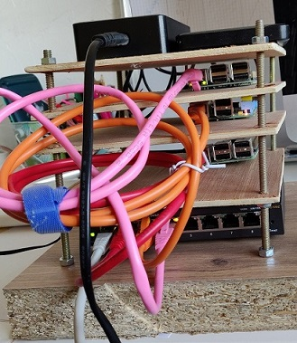
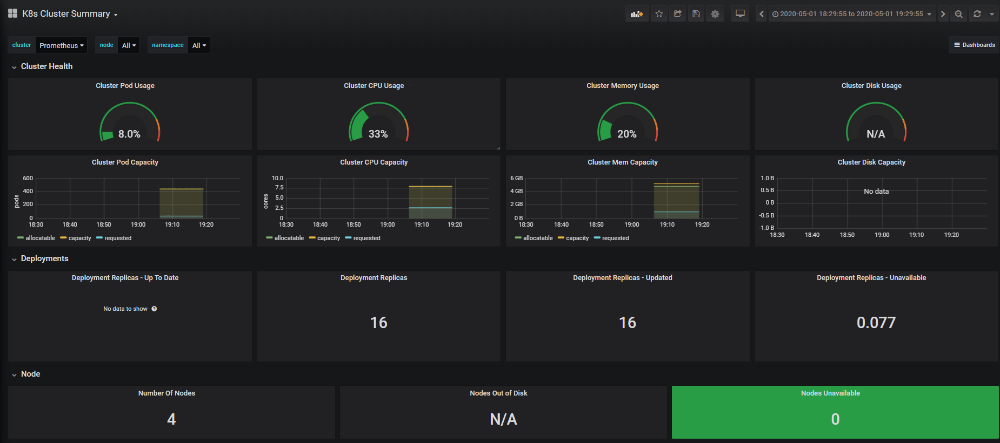
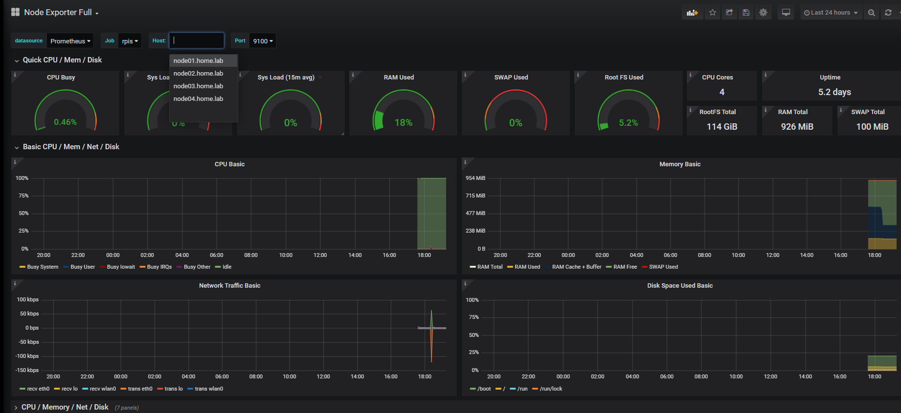
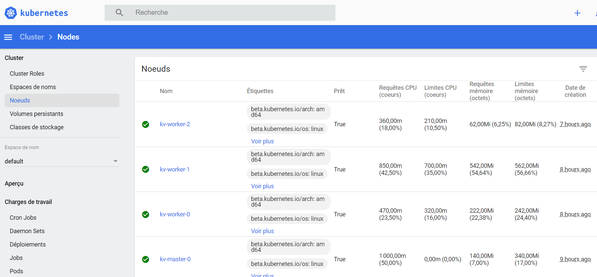
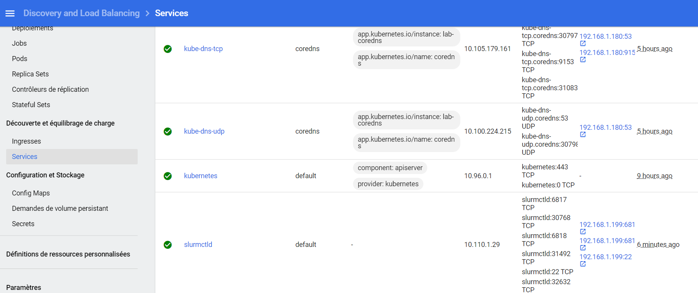
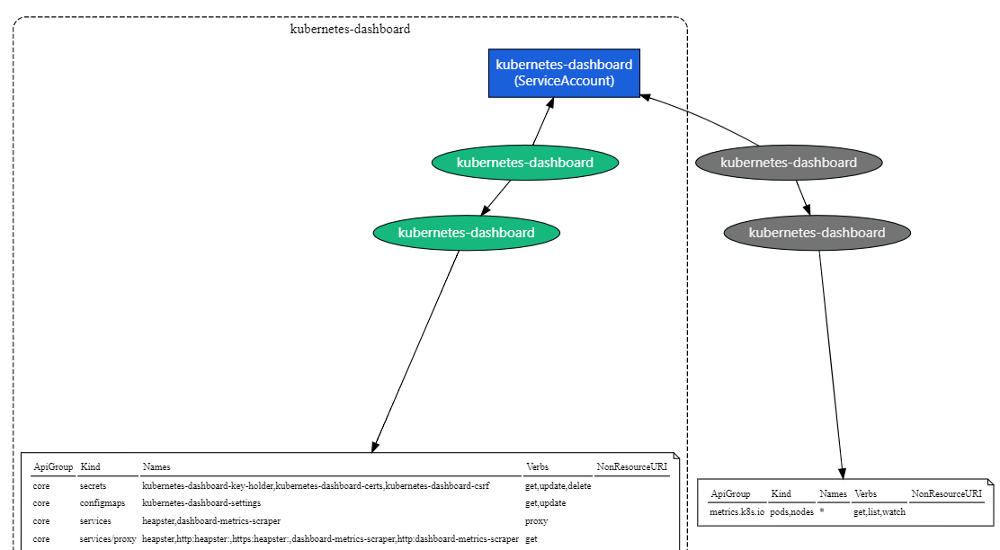
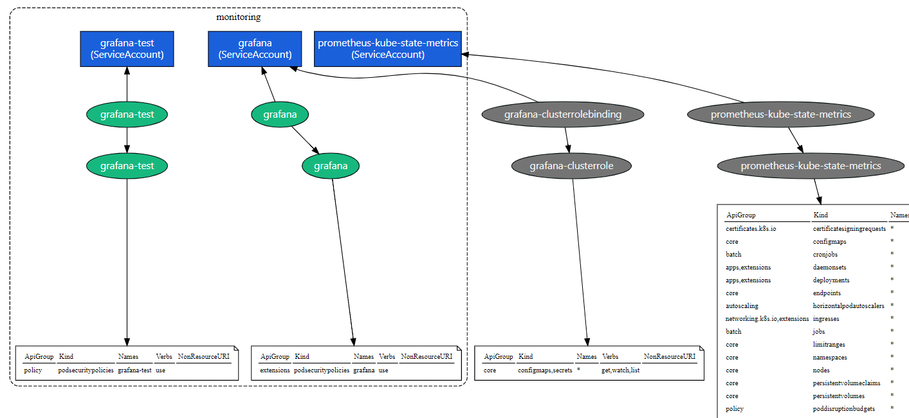

# Orchestrated RPi cluster

## Objective
Build a HPC home-lab based on RPIs managed by a K8S cluster on a laptop

* RPi Cluster View (COVID19 - built with some stuff I had at that time :-) )



* Grafana Cluster Status



* Grafana RPI Cluster Status



* K8S dashboard nodes



* K8S dashboard services



**Status: work in progress**

## Hardware
- A laptop/desktop to run the K8S cluster (CPU: VT-x capable CPU, RAM: min: 8GB memory, max: no limits)
    * Linux or Windows 10 PRO (not tested with family, but should work)
    * Vagrant
    * Virtualbox

- As many as RPIs you have from RPi2 to RPi4
- 1 switch
- Some RJ45 cables
- 1 multi-USB power station
- Optionally 1 External DD or a NAS to have some NFS storage capacity (without, the storage node SD card will be enough)

## Building the RPi cluster
- build a stand or buy a RPis cluster case
- flash all the RPi SD with the latest Raspbian version
- connect all power/switch ports
- power up 

## Roles
- RPIs[01]: storage node with NFS server - how to install (will be writen later)

- RPis[02-0x]: compute nodes  - how to install (will be writen later)

- Laptop: K8S server providing basic cluster services:
    * SLURM controller (in progress)
    * DHCPD server (in progress)
    * DNS server (in progress)
    * PXE boot (not yet implemented)
    * Docker registry
    * ... more to come
- K8S services:
    * grafana & prometheus monitoring
    * K8S dashboard
    * metallb
    * ... more to come

## Services IPs
By default DHCP is set between: 192.168.1.150-199
(Not yet implemented like this)
Fixed Services endpoints for admins:
* NFS Server: 20
* DNS Server: 180
* DHCP Server: 181
* dashboard: 190
* grafana: 191
* prometheus-server: 192
* prometheus-pushgateway: 192

Fixed Services endpoints for end users:
* docker registry: 197
* ChartMuseum: 198
* TFTP: 199
* SFTP: 198

## RBAC related topics

Currently RBAc is being used in some areas but not all ...
Using https://github.com/alcideio/rbac-tool you can get more details about your running cluster

* RBAC for K8S dashboard services



* RBAC for Grafana



## SLURM

Currently using SLURM 18.08.5 - Ubuntu 18.04 (otherwise the slurm node_exporter for Ubuntu cannot be compiled)
Note: missleading name of the containers: docker-ubuntu1604-xxx are in fact Ubuntu18.04 :-).

Open MPI - is compiled and running on the RPis.

Example:
```
$ kubectl get pods -n slurm-ns
NAME                     READY   STATUS    RESTARTS   AGE
slurm-745f46bd9b-26nms   1/1     Running   0          4m28s

$ kubectl exec slurm-745f46bd9b-26nms -n slurm-ns -- sinfo
PARTITION AVAIL  TIMELIMIT  NODES  STATE NODELIST
allnodes*    up   infinite      1   unk* node05
allnodes*    up   infinite      1  drain node03
allnodes*    up   infinite      2   idle node[02,04]
```

## What's next

Steps to deploy:

* Power up the K8S cluster on your laptop
By default: 1 Master and 3 workers
Update the Vagrantfile to match your subnets.
```
$ vagrant up
```
Then, wait 1h or so depending on the speed of your internet speed.
```
$ vagrant status
$ vagrant ssh xxx
```
then manually update /etc/resolv.conf with the eth1 value (will be fixed soon)
```
$ cat .kube/config
```
Save the content to put in on your laptop %HOME%/.kube/config. This will allow kubectl actions from your powershell.

Check that the kubelet config is set correctly (on all masters and workers)
```
sudo cat /etc/default/kubelet
KUBELET_EXTRA_ARGS=--node-ip=<eth1 ip>
```
if not, fix it, and restart kubelet
```
sudo service kubelet restart
```

From your laptop, check the status of your K8S cluster:
```
$ kubectl get nodes
NAME          STATUS   ROLES    AGE    VERSION
kv-master-0   Ready    master   4d4h   v1.18.2
kv-worker-0   Ready    <none>   4d4h   v1.18.2
kv-worker-1   Ready    <none>   4d3h   v1.18.2
kv-worker-2   Ready    <none>   4d3h   v1.18.2
```

* Deploy Metallb
```
$ cd metallb
```
Read the README file for details

* Create all namspaces needed by the project
```
$ kubectl apply -f createNamespaces.yaml
```

* Deploy persistentVolume
```
$ cd persistentVolume
```
Read the README file for details

* Deploy k8s dashboard
```
$ cd k8sdashboard
```
Read the README file for details

* Deploy coredns
```
$ cd coredns
```
Read the README file for details

* Deploy docker registry and ChartsMuseum
```
$ cd registry
```
Read the README file for details

* Deploy monitoring
```
$ cd monitoring
```
Read the README file for details

* Deploy dhcpd
```
$ cd dhcpd
```
Read the README file for details

* Deploy SFTPD
```
$ cd ftpsvc/sftp-server
```
Read the README file for details

* Deploy TFTPD
```
$ cd ftpsvc/tftp-server
```
Read the README file for details

* Deploy slurmctl
```
$ cd slutmctld
```
Read the README file for details

* Finish the config of your RPis
```
$ cd rpicluster
```
Read the README file for details

Launch your SLURM jobs :-)