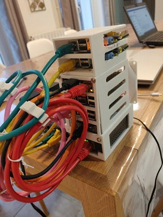

# Orchestrated RPi cluster

## Objective
Build a HPC home-lab based on RPIs managed by a K8S cluster on a laptop

* RPi Cluster View (COVID19 - built with some stuff I had at that time :-) )



* 3D view of the in-progress final cluster stack


* Grafana Cluster Status


* Grafana RPI Cluster Status


* Grafana SLURM monitoring


* Kibana ElasticSearch Fluentd Metricbeat (Work in progress)


* Prometheus Targets


* K8S dashboard nodes


* K8S dashboard services


**Status: work in progress**

## Hardware
- A laptop/desktop to run the K8S cluster (CPU: VT-x capable CPU, RAM: min: 8GB memory (without the EFK stack), desired: 16GB, max: no limits)
    * Linux or Windows 10 PRO (not tested with family, but should work)
    * Vagrant
    * Virtualbox

- As many as RPIs you have from RPi2 to RPi4
- 1 switch
- Some RJ45 cables
- 1 multi-USB power station
- Optionally 1 External DD or a NAS to have some NFS storage capacity (without, the storage node SD card will be enough)

## Building the RPi cluster
- build a stand or buy a RPis cluster case
- flash all the RPi SD with the latest Raspbian version
- connect all power/switch ports
- power up
- Update all /etc/dhcpcd.conf or /etc/network/interfaces (depending on the RPi version) to fix the IPs of the nodes:
    * node01: 10.0.0.2
    * node02: 10.0.0.3
    * node03: 10.0.0.4
    * node04: 10.0.0.5
    * node05: 10.0.0.6

## Roles
- RPIs[01]: storage node with NFS server - how to install (will be writen later)

- RPis[02-0x]: compute nodes  - how to install (will be writen later)

- Laptop: K8S server providing basic cluster services:
    * SLURM controller (in progress)
    * DHCPD server (in progress)
    * DNS server (in progress)
    * PXE boot (not yet implemented)
    * Docker registry
    * ... more to come
- K8S services:
    * grafana & prometheus monitoring
    * K8S dashboard
    * metallb
    * ... more to come

## Configuration of your laptop network

The aim is to have the laptop connected using the Wifi to the external world, and use the Laptop Eth0 interface to connect the RPi Cluster. This needs some preparation:
1) If your laptop does not have an Ethernet port (yeah, many now just have a Wifi adapter), you can buy a USB-C 10 adapters with an ethernet port
2) Update the registry key: HKEY_LOCAL_MACHINE\System\CurrentControlSet\Services\SharedAccess\Parameters and set the values to 10.0.0.1 instead of 192.168.137.1
3) Configure Windows ISC on the Wifi adapter to share the wifi and setup the Windows 10 built-in DHCP server

4) Connect the switch to the Laptop ethernet port, power-up the RPis, after some time you should get all online with an ip on the 10.0.0.0/24 subnet


Using this setup, the Vagrant VMs will be assigned the following IPs:
* kv-master-0: 10.0.0.210
* kv-worker-0: 10.0.0.220
* kv-worker-1: 10.0.0.221
* kv-worker-2: 10.0.0.222

## Services IPs
By default DHCP is set between: 192.168.1.150-199
(Not yet implemented like this)
Fixed Services endpoints for admins:
* NFS Server: 10.0.0.20
* DNS Server: 10.0.0.21
* DHCP Server: 10.0.0.22
* dashboard: 10.0.0.30
* grafana: 10.0.0.31
* prometheus-server: 10.0.0.32
* prometheus-pushgateway: 10.0.0.33
* Kibana: 10.0.0.34

Fixed Services endpoints for end users:
* docker registry: 10.0.0.25
* ChartMuseum: 10.0.0.26
* TFTP: 10.0.0.23
* SFTP: 10.0.0.24

## RBAC related topics

Currently RBAc is being used in some areas but not all ...
Using https://github.com/alcideio/rbac-tool you can get more details about your running cluster

* RBAC for K8S dashboard services


* RBAC for Grafana


## SLURM

Currently using SLURM 18.08.5 - Ubuntu 18.04 (otherwise the slurm node_exporter for Ubuntu cannot be compiled)
Note: missleading name of the containers: docker-ubuntu1604-xxx are in fact Ubuntu18.04 :-).

Open MPI - is compiled and running on the RPis.

Example:
```
$ kubectl get pods -n slurm-ns
NAME                     READY   STATUS    RESTARTS   AGE
slurm-745f46bd9b-26nms   1/1     Running   0          4m28s

$ kubectl exec slurm-745f46bd9b-26nms -n slurm-ns -- sinfo
PARTITION AVAIL  TIMELIMIT  NODES  STATE NODELIST
allnodes*    up   infinite      1   unk* node05
allnodes*    up   infinite      1  drain node03
allnodes*    up   infinite      2   idle node[02,04]
```

## What's next

Steps to deploy:

* Power up the K8S cluster on your laptop
By default: 1 Master and 3 workers
Update the Vagrantfile to match your subnets.
```
$ vagrant up
```
Then, wait 1h or so depending on the speed of your internet speed.
```
$ vagrant status
$ vagrant ssh xxx
```
then manually update /etc/resolv.conf with the eth1 value (will be fixed soon)
```
$ cat .kube/config
```
Save the content to put in on your laptop %HOME%/.kube/config. This will allow kubectl actions from your powershell.

Check that the kubelet config is set correctly (on all masters and workers)
```
sudo cat /etc/default/kubelet
KUBELET_EXTRA_ARGS=--node-ip=<eth1 ip>
```
if not, fix it, and restart kubelet
```
sudo service kubelet restart
```

From your laptop, check the status of your K8S cluster:
```
$ kubectl get nodes
NAME          STATUS   ROLES    AGE    VERSION
kv-master-0   Ready    master   4d4h   v1.18.2
kv-worker-0   Ready    <none>   4d4h   v1.18.2
kv-worker-1   Ready    <none>   4d3h   v1.18.2
kv-worker-2   Ready    <none>   4d3h   v1.18.2
```

* Deploy Metallb
```
$ cd metallb
```
[Read the README file for details](metallb/README.md)

* Create all namspaces needed by the project
```
$ kubectl apply -f createNamespaces.yaml
```

* Deploy persistentVolume
```
$ cd persistentVolume
```
[Read the README file for details](persistentVolume/README.md)

* Deploy k8s dashboard
```
$ cd k8sdashboard
```
[Read the README file for details](k8sdashboard/README.md)

* Deploy coredns
```
$ cd coredns
```
[Read the README file for details](coredns/README.md)

* Deploy docker registry and ChartsMuseum
```
$ cd registry
```
[Read the README file for details](registry/README.md)

* Deploy monitoring
```
$ cd monitoring
```
[Read the README file for details](monitoring/README.md)

* Deploy logging (Work in progress)
```
$ cd logging
```
[Read the README file for details](loggingEFK/README.md)

* Deploy dhcpd (Work in progress)
```
$ cd dhcpd
```
[Read the README file for details](dhcp/README.md)

* Deploy SFTPD
```
$ cd ftpsvc/sftp-server
```
[Read the README file for details](stpsvc/sftp-server/README.md)

* Deploy TFTPD
```
$ cd ftpsvc/tftp-server
```
[Read the README file for details](stpsvc/ftps-server/README.md)

* Deploy slurmctl
```
$ cd slutmctld
```
[Read the README file for details](slurmctld/README.md)

* Finish the config of your RPis
```
$ cd rpicluster
```
Read the README file for details

Launch your SLURM jobs :-)
