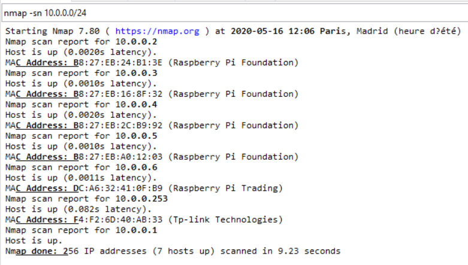

# Orchestrated RPi cluster

## Objective
Build a HPC home-lab based on RPIs managed by a K8S cluster on a laptop.
Basically, the laptop is used to host the K8S cluster and all services required in an HPC cluster.
The RPis are used as compute nodes and 1 is also acting as the storage node internal for K8S and external for backups.

Services front-ends:
- Forecastle as application dashboard solution
- Keycloak as SSO solution
- Harbor as registry & chart museum solution
- Grafana / Prometheus / Karama / node_exporters as monitoring solution
- Dashboard K8S as overall admin solution
- Netbox as DCIM solution
- JupyterHub as developers dream
- Discourse as FAQ solution
- Velero as backup solution
- ELK stack as logging solution (optionnal since it requires plenty of CPUs/RAM on the Windows machine)
- Singularity Enterprise as job container solution (optionnal since it requires a valid license - not available on this github)

End-user additonal services:
- Ansible pod as deployment solution
- Slurm as Workload scheduler solution

Storage node services:
- minio as S3 solution
- NFS server as dynamic storage class for K8S services

Screenshots:

* RPi Cluster View ( 3D printed racks )


* Apps dashboard


* K8S lens ... dashboard on steroids


* Netbox: 'The source of truth' :-)


* Grafana Cluster Status


* Grafana RPI Cluster Status


* Grafana SLURM monitoring


* Kibana ElasticSearch Fluentd Metricbeat (Work in progress)


* Prometheus Targets


* K8S dashboard nodes


* K8S dashboard services


## High-level design


## Compatibility

| Branch / Kubernetes Version         |       1.17.X       |       1.18.X       | 
| ----------------------------------- | :----------------: | :----------------: | 
| Master                              | :x:                | :white_check_mark: |


- :white_check_mark: Compatible
- :warning: Has issues
- :x: Incompatible

## System description

- RPis[01]:
  * Specs: RPi 3 or 4, with attached USB disk
  * role: storage node with NFS server
  * role: ansible deployment node (not yet implemented)
- RPis[02-0x]: compute nodes
- Laptop: Vagrant-based K8S server providing the management stack of this tiny HPC-RPi cluster. 
  * Specs: CPU: VT-x capable CPU, RAM: min: 8GB memory (without the EFK stack), desired: 16GB, max: no limits
  * Windows 10 PRO - not tested with Linux, but should work
  * Vagrant
  * Virtualbox
- 1 switch
- Some RJ45 cables
- 1 multi-USB power station

## Network and Laptop configuration

The aim is to have the laptop connected using the Wifi to the external world, and use the Laptop Eth0 interface to connect the RPi Cluster. This needs some preparation:
1) If your laptop does not have an Ethernet port (yeah, many now just have a Wifi adapter), you can buy a USB-C 10 adapters with an ethernet port
2) Update the registry key: HKEY_LOCAL_MACHINE\System\CurrentControlSet\Services\SharedAccess\Parameters and set the values to 10.0.0.1 instead of 192.168.137.1
3) Configure Windows ISC on the Wifi adapter to share the wifi and setup the Windows 10 built-in DHCP server

4) Connect the switch to the Laptop ethernet port, power-up the RPis, after some time you should get all online with an ip on the 10.0.0.0/24 subnet



Using this setup, the Vagrant VMs will be assigned the following IPs:
* kv-master-0: 10.0.0.210
* kv-worker-0: 10.0.0.220
* kv-worker-1: 10.0.0.221
* kv-worker-2: 10.0.0.222

5) Update the file: C:\Windows\System32\drivers\etc\hosts to add the node[01-05] IPs, it will be more convenient.

6) Install some Vagrant plugins
```
$ vagrant plugin install vagrant-scp
$ vagrant plugin install vagrant-winnfsd
$ vagrant plugin install vagrant-cachier
```

7) Default docker registry setup on worker nodes (can be customized), but it is automatically like this by default:
```
$ cat /etc/docker/daemon.json
{
  "exec-opts": ["native.cgroupdriver=systemd"],
  "log-driver": "json-file",
  "log-opts": {
    "max-size": "100m"
  },
  "insecure-registries": ["https://registry.home.lab,"https://harbor.home.lab"],
  "registry-mirrors": ["https://docker.io","https://quay.io","https://hub.docker.com"],
  "storage-driver": "overlay2"
}
$  systemctl daemon-reload && systemctl restart docker
```

Note: easily populate your local docker repositories with all running images of your K8S cluster. This is used when the cluster is up and running to populate the Harbor registry with all running docker images. From the workers do:
```
docker login --username=admin --password=Harbor12345
for i in $(docker images --format="{{.Repository}}:{{.Tag}}" | grep -v home.lab); do 
  docker tag $i harbor.home.lab/library/$i
  docker push harbor.home.lab/library/$i
done
```

## Raspeberry PIs configuration

- build a stand or buy a RPis cluster case
- flash all the RPi SD with the latest Raspbian version
- connect all power/switch ports
- power up
- Those steps will be automated later on...
  - Update all /etc/dhcpcd.conf or /etc/network/interfaces (depending on the RPi version) to fix the IPs of the nodes:
    * node01: 10.0.0.2
    * node02: 10.0.0.3
    * node03: 10.0.0.4
    * node04: 10.0.0.5
    * node05: 10.0.0.6
    Also fix in /etc/dhcpcd.conf the line about:
    ```
    static routers=10.0.0.1
    static domain_name_servers=10.0.0.20 8.8.8.8
    ```
    or in /etc/network/interfaces:
    ```
    gateway 10.0.0.1
    dns-nameservers 10.0.0.20 8.8.8.8
    ```
  - The node01.home.lab is acting as a special node:
    * apt-cacher-ng
    ```
    apt-get install apt-cacher-ng
    ```
    On the other nodes, just add a file: /etc/apt/apt.conf.d/02proxy
    and add: ```Acquire::http::proxy "http://node01.home.lab:3142";```

  - In order to provide NFS shares to the K8S cluster, it is good to split it into partitions to have dedicated storage for the apps.
    Note: the number of partitions needed will depeend on how many persistent volumes you will need for the apps (5 + 1 is a good number for the default setup)
    So, you can split your HDD on the node01 RPi using those commands:
    ```
    $ fdisk -l
    ** retrieve the /dev/sdX matching the HDD **
    ```
    If your HDD is not configured with 6 partitions:
    Note: 
      * /mnt/sda1..5: 10GB - ext4 - static K8S Volumes.
      * /mnt/sda6: at least 50GB - ext4 - should be bigger since it acts as NFS dynamic volume for K8S.

    ```
    $ parted /dev/sda
    ** here use the "mkpart primary ext4 xxG yyG" to create the different partitions **
    $ mkfs.ext4 /dev/sdaX
    ** update the fstab to identify the new /dev/sdaX partitions **
    $ mkdir /mnt/usbX
    $ chown nobody:nogroup -R /mnt/usbX
    $ chmod 777 -R /mnt/usbX
    $ vi /etc/exports
    ** add "/mnt/usbX        10.0.0.0/24(rw,sync,no_root_squash,no_subtree_check)"
    $ exportfs -ra
    ```
  
  - NTP time on RPIs
    ```
    $ vi /etc/systemd/timesyncd.conf
    ... NTP=10.0.0.210
    $ timedatectl set-ntp true
    $ systemctl daemon-reload
    $ service systemd-timesyncd restart
    $ timedatectl set-timezone Europe/Paris
    ```

## Services IPs

Fixed Cluster Services endpoints for admins:
* NFS Server: 10.0.0.2
* DNS: 10.0.0.20
* UI entry point: https://apps.home.lab (aka: 10.0.0.10)
* SLURM controller for rack01: 10.0.0.9

## SLURM

Currently using SLURM 18.08.5 - Ubuntu 18.04 (otherwise the slurm node_exporter for Ubuntu cannot be compiled)
Note: missleading name of the containers: docker-ubuntu1604-xxx are in fact Ubuntu18.04 :-).

Open MPI - is compiled and running on the RPis.

Example:
```
$ kubectl get pods -n slurm-ns
NAME                     READY   STATUS    RESTARTS   AGE
slurm-745f46bd9b-26nms   1/1     Running   0          4m28s

$ kubectl exec slurm-745f46bd9b-26nms -n slurm-ns -- sinfo
PARTITION AVAIL  TIMELIMIT  NODES  STATE   NODELIST
allnodes*    up   infinite      1   unk*   node05
allnodes*    up   infinite      1  drain   node03
allnodes*    up   infinite      2  idle    node[02,04]
```

## How to easily deploy all services on the cluster

Steps to deploy:

* Power up the K8S cluster on your laptop
By default: 1 Master and 3 workers
Update the Vagrantfile to match your subnets.

```
$ vagrant up
```
Then, wait 1h or so depending on the speed of your internet speed.
```
$ vagrant status
$ scp -P 2200 vagrant@kv-master-0:/vagrant/.kube/config ~/.kube/config
```

From your laptop, check the status of your K8S cluster:
```
$ kubectl get nodes
NAME          STATUS   ROLES    AGE    VERSION
kv-master-0   Ready    master   4d4h   v1.18.2
kv-worker-0   Ready    <none>   4d4h   v1.18.2
kv-worker-1   Ready    <none>   4d3h   v1.18.2
kv-worker-2   Ready    <none>   4d3h   v1.18.2
```

* Easy way to start all services
```
$ ./pb-install-all.sh --deploy
```

Then just wait .... and enjoy.
Launch your SLURM jobs :-)

* Note: the main UI giving access to all others UI is set to: https://apps.home.lab
This UI is protected by keycloak. So you must add users in Keycloak first: https://keycloak.home.lab
(User: admin, Password: to be retrieved as a secret: keycloak-http)

## Debug tips

* when you have a worker vm which is stuck or need a reboot, here is how to take it back in the cluster
```
From the worker node after reboot
1. Reset your node
$ sudo kubeadm reset
2. Turn off the swap
$ sudo swapoff -a
3. start kubeadm join (info found ni the kubeadm-init.out file generated during vagrant deployment)
$ sudo kubeadm join YourMasterNodeIPAddress --token xxxx --discovery-token-ca-cert-hash \
sha256...
```

## RBAC related topics

Currently RBAc is being used in some areas but not all ...
Using https://github.com/alcideio/rbac-tool you can get more details about your running cluster

* RBAC for K8S dashboard services


* RBAC for Grafana


## The Hard way if you want to customize something :-)

You can always depp-dive into every repositories and change whatever you need :-). A README.md file is there to tell you how to deploy the part. However, all services have to be deployed in a given order, so follow the same steps as in pb-install-all.sh script.
