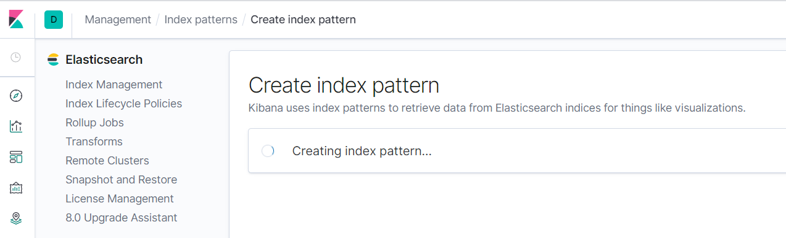

# Logging with EFK stack (ElasticSearch/Fluentd/Kibana)

## WARNING

Installing this part consummes a lot of resources and appear to be not very stable for this kind of setup.
So except for learning, it does not manadatory for this Lab :-)

## Installation instructions
* Mandatory for a basic setup:
```
$ kubectl create namespace logging
$ helm repo add elastic https://helm.elastic.co
```
Install Elastic Search version 7.6.2 with 10GB sized volumes in the logging namespace.
Install Kibana
```
helm install elasticsearch elastic/elasticsearch --set imageTag=7.6.2 -n logging  --set volumeClaimTemplate.resources.requests.storage=10Gi --set replicas=1 --set service.type=LoadBalancer

helm install kibana elastic/kibana --set imageTag=7.6.2 -n logging --set elasticsearchHosts="http://elasticsearch-master.logging.svc.cluster.local:9200" --set service.type=LoadBalancer --set replicas=1 
```

* Optional steps:
```
helm install fluent-bit stable/fluent-bit -n logging --set backend.type=es --set  backend.es.host="elasticsearch-master.logging.svc.cluster.local" --set filter.mergeJSONLog=true --set extraEntries.filter="Merge_Log_Key logfield" --set backend.es.retry_limit=5

helm install metricbeat elastic/metricbeat -n logging
```

* Configure the index based on metricbeat in Kibana.




## Validation
Check that all pods are running fine (it takes quite a while at each step because of cpu/memory limits put in place)
```
$ kubectl get pods -n logging
NAME                                             READY   STATUS              RESTARTS   AGE
elasticsearch-master-0                           1/1     Running             0          73m
fluent-bit-6wdt6                                 1/1     Running             0          18m
fluent-bit-9smdd                                 1/1     Running             0          18m
fluent-bit-nlwk2                                 1/1     Running             0          18m
kibana-kibana-7f7b86cc77-45h2q                   1/1     Running             1          60m
metricbeat-kube-state-metrics-6f88454b98-x2r8h   1/1     Running             0          3m3s
metricbeat-metricbeat-28q6h                      1/1     Running             0          3m3s
metricbeat-metricbeat-8jg4x                      1/1     Running             0          3m3s
metricbeat-metricbeat-9j4l7                      1/1     Running             0          3m3s
metricbeat-metricbeat-metrics-5d848586bd-qstbd   1/1     Running             0          3m3s
```

Then access the Kibana dashboard :-)

## Rebuild since Kibana / Elasticsearch is a pain on such cluster

helm delete elasticsearch -n logging
helm delete fluent-bit -n logging
helm delete kibana -n logging
helm delete metricbeat -n logging
kubectl delete pvc -n logging --all

## RPis configurations

```
wget -qO - https://packages.fluentbit.io/fluentbit.key | sudo apt-key add -
```
Update the /etc/apt/sources.list
```
deb https://packages.fluentbit.io/raspbian/buster buster main
```
And then, move on:
```
sudo apt-get update
sudo apt-get install td-agent-bit
sudo vi /etc/td-agent-bit/td-agent-bit.conf
Example
>>>>
[SERVICE]
    Flush        5
    Daemon       Off
    Log_Level    info
    Parsers_File parsers.conf
    Plugins_File plugins.conf
    HTTP_Server  Off
    HTTP_Listen  0.0.0.0
    HTTP_Port    2020

[INPUT]
    Name cpu
    Tag  cpu.local
    Interval_Sec 2

[INPUT]
    Name mem
    Tag memory

[INPUT]
    Name netif
    Tag netif
    Interval_Sec 2
    Interval_Nsec 2
    Interface eth0

[INPUT]
    Name Thermal
    Tag my_thermal

[INPUT]
    Name systemd
    Tag host.*

[INPUT]
    Name              tail
    Tag               syslog
    Path              /var/log/syslog
    Path_Key          filename
    Refresh_Interval  10

[OUTPUT]
    Name  es
    Match *
    Host 192.168.1.179
    Port 9200
    Index fluent_bit_node

sudo service td-agent-bit restart
```